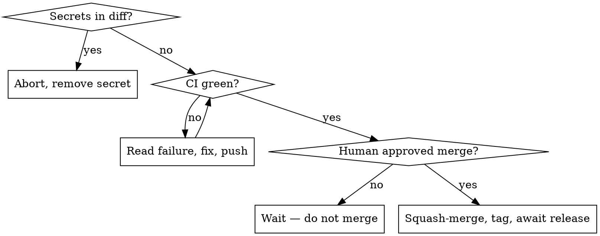

# Ship (ignis)

Land the current branch on `master` through a reviewed PR, then cut a tag that the
`Release` workflow turns into cross-platform binaries.

**Version source of truth: the `[package] version` in `ignis/Cargo.toml`.** The git
tag is `v<that version>`. There is no separate VERSION file.

## Iron rules

- **Never push a diff that contains a secret.** Scan first; abort on any hit.
- **Never squash-merge without explicit human approval.** Prepare everything, then stop and ask.
- **Bump version + CHANGELOG inside the PR, before merge** — never as a direct commit to `master` after.
- Every gate must pass. On failure: stop, show the output, fix, re-run. No skipping.



## Process

### 0. Preflight
- Working tree clean (`git status`); commit or stash first.
- Not on `master` — if you are: `git switch -c <type>/<slug>`.
- Sync: `git fetch origin && git rebase origin/master` (resolve conflicts before continuing).

### 1. Gate — must all pass
```bash
cargo fmt --all -- --check        # if it fails: cargo fmt --all, then recommit
cargo clippy --workspace --all-targets -- -D warnings
cargo test --workspace            # unit + integration + pty TUI e2e
```
New behavior must have tests.

### 2. Smoke
```bash
cargo build --release
```
Optional live check (only if `~/.ignis/config.toml` has a working provider — needs
network, spends tokens):
```bash
./target/release/ignis "use the bash tool to run: echo ok; then reply only ok"
```

### 3. Secret scan — must be clean
```bash
git diff origin/master...HEAD | \
  grep -nE 'sk-[A-Za-z0-9-]{24,}|ghp_[A-Za-z0-9]{20,}|gho_[A-Za-z0-9]{20,}|AKIA[0-9A-Z]{16}|BSA[A-Za-z0-9]{20,}' \
  && echo 'SECRET FOUND — abort' || echo clean
```
Any hit → stop, remove it, re-scan. Never push a secret.

### 4. Open PR
```bash
git push -u origin HEAD
gh pr create --base master --title "<concise>" --body "<concise summary + checklist>"
```

### 5. Make CI pass
```bash
gh pr checks --watch
```
If red: open the failing job, root-cause, fix, push, re-watch. Proceed only when every check is green.

### 6. Version + CHANGELOG (commit to the PR, then STOP)
1. Pick the bump from commits since the last tag — `feat:` → minor, `fix:`/`chore:`/`docs:` → patch, `!`/`BREAKING CHANGE` → major:
   ```bash
   git log "$(git describe --tags --abbrev=0 2>/dev/null || echo)"..HEAD --pretty=%s
   ```
   No prior tag → this is the initial release; keep the current version.
2. Set `version` in `ignis/Cargo.toml` to `X.Y.Z`, then `cargo build` to refresh `Cargo.lock`.
3. `CHANGELOG.md`: rename `## [Unreleased]` to `## [X.Y.Z] - YYYY-MM-DD` and add a fresh empty `## [Unreleased]`.
   **Entries are one-line summaries only.** State *what changed* for a user, nothing more. No detail, no how-it-works, no implementation list, no rationale or trade-offs, no parentheticals enumerating internals. One short line per change.
   - Good: `` - `/copy` — copy the last assistant reply to the system clipboard. ``
   - Bad: `` - `/copy` slash command — copies the last reply via a platform CLI tool (`pbcopy`/`clip`/`clip.exe`/`wl-copy`/…); 1 MiB cap, no native-clipboard dependency. ``
4. `git commit -am "chore(release): vX.Y.Z" && git push`
5. Re-confirm CI is green on the new commit.
6. **STOP.** Tell the user: "PR <url> is green, bumped to vX.Y.Z — approve squash-merge?" Wait for an explicit yes.

### 7. Squash-merge (only after approval)
```bash
gh pr merge <num> --squash --delete-branch
```

### 8. Tag + await release
```bash
git switch master && git pull
git tag vX.Y.Z && git push origin vX.Y.Z      # triggers the Release workflow
gh run watch "$(gh run list --workflow Release --limit 1 --json databaseId -q '.[0].databaseId')"
gh release view vX.Y.Z                          # confirm binaries are attached
```
Report the release URL.

## Common mistakes

| Mistake | Do instead |
|---------|-----------|
| Bump version after merge | Bump in the PR; the squash-merge carries it |
| Auto-merge when CI turns green | Always wait for explicit approval |
| Tag ≠ `ignis/Cargo.toml` version | Tag is exactly `v<Cargo.toml version>` |
| Skip `cargo build` after bump | Stale `Cargo.lock` fails the `--locked` release build |
| Secret-scan false alarm on placeholders | The regex targets real key shapes; `sk-your-…` placeholders are short and won't match |
