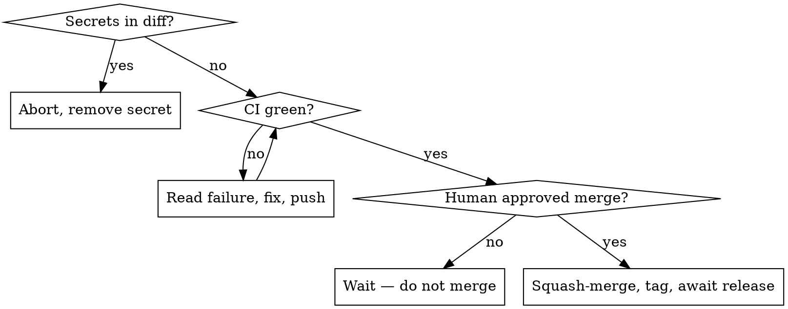

# Ship (ignis)

Land the current branch on `master` through a reviewed PR, then cut a tag that the
`Release` workflow turns into cross-platform binaries.

**Version source of truth: the `[package] version` in `ignis/Cargo.toml`.** The git
tag is `v<that version>`. There is no separate VERSION file.

## Iron rules

- **Never push a diff that contains a secret.** Scan first; abort on any hit.
- **Never squash-merge without explicit human approval.** Prepare everything, then stop and ask.
- **Bump version + CHANGELOG inside the PR, before merge** — never as a direct commit to `master` after.
- Every gate must pass. On failure: stop, show the output, fix, re-run. No skipping.



## Process

### 0. Preflight
- Working tree clean (`git status`); commit or stash first.
- Not on `master` — if you are: `git switch -c <type>/<slug>`.
- Sync: `git fetch origin && git rebase origin/master` (resolve conflicts before continuing).

### 1. Gate — must all pass
```bash
cargo fmt --all -- --check        # if it fails: cargo fmt --all, then recommit
cargo clippy --workspace --all-targets -- -D warnings
cargo test --workspace            # unit + integration + pty TUI e2e
```
New behavior must have tests.

### 2. Smoke
```bash
cargo build --release
```

### 3. Dogfood (ask the human if it's needed)
**Ask the human whether this change needs dogfooding before shipping** — don't
decide silently. Dogfooding means using the built binary the way a real user
would, to catch what unit tests miss (TUI layout, real provider behavior, the
exact path you changed). Skip only with their OK (e.g. docs/CI-only changes).

**Cover every user-visible path of the feature, not just the change set.**
Unit tests prove the mechanism (decision logic, picker question shape); only
the real binary proves the *integrated path* (tool call → hook fires →
channel ferries to TUI → renderer reads state → reply travels back → mode
persists → next launch reads it). The classes of bug only dogfood catches:

- Wrong picker / view tags on shared infrastructure (a hardcoded label that
  was right for one caller and wrong for a later one)
- Stale CLI flags / state fields that look fine in unit tests but break the
  user-visible flow
- Wiring gaps between subsystems (footer doesn't read the new state, slash
  command doesn't persist, restart loses the setting)
- Visual: any color, alignment, or layout claim — tool output is plain text,
  you cannot judge colors from it, you must look at a PNG

Before opening the PR, list every user-visible path of the feature (the
slash command flow, the picker variants, the CLI flag, the state-restore on
restart, every observable behavior toggle). Drive each one against the real
binary. Skipping a path requires either (a) unit-test coverage that proves
the integration boundary the path would exercise is unreachable, or (b)
explicit human sign-off (e.g. `rm -rf /` family — the dogfood would put the
host at risk, accept unit-test coverage + sandbox follow-up).

Use the **`dogfood`** skill (`.claude/skills/dogfood/`) for how — it covers
both behavioral checks (one-shot CLI / state) and **visual** checks. For
anything visual (TUI), you can't judge colors or layout from tool output:
screenshot the real TUI to a PNG with `dogfood/tui_shot.py` and actually
`Read` it. Report exactly which paths you exercised and the result of each.

### 4. Secret scan — must be clean
```bash
git diff origin/master...HEAD | \
  grep -nE 'sk-[A-Za-z0-9-]{24,}|ghp_[A-Za-z0-9]{20,}|gho_[A-Za-z0-9]{20,}|AKIA[0-9A-Z]{16}|BSA[A-Za-z0-9]{20,}' \
  && echo 'SECRET FOUND — abort' || echo clean
```
Any hit → stop, remove it, re-scan. Never push a secret.

### 5. Open PR
```bash
git push -u origin HEAD
gh pr create --base master --title "<concise>" --body "<concise summary + checklist>"
```

### 6. Review (ask the human which reviewer)
Get a code review of the PR diff before chasing CI. **Ask the human which reviewer
to use — don't pick silently:**

- **Subagent** — dispatch one Claude review agent over the branch diff:
  `Agent(subagent_type: "general-purpose")` with: *"Review `git diff
  origin/master...HEAD` in this repo for bugs, regressions, and risky changes.
  Report only real issues as file:line + severity; skip style nits."*
- **Codex** — `codex exec review --base master`
- **Gemini** — `git diff origin/master...HEAD | gemini -p "Review this diff for
  bugs, regressions, and risky changes. List only real issues as file:line +
  severity; be concise."`

Then read the findings, **fix real issues and push**, and note any dismissed
finding with a one-line rationale. An *intended* breaking change is triaged
(documented in the CHANGELOG), not patched with compat code — see CLAUDE.md.
Proceed only when the diff is clean or every finding is triaged.

### 7. Make CI pass
```bash
gh pr checks --watch
```
If red: open the failing job, root-cause, fix, push, re-watch. Proceed only when every check is green.

### 8. Version + CHANGELOG (commit to the PR, then STOP)
1. Pick the bump from commits since the last tag — `feat:` → minor, `fix:`/`chore:`/`docs:` → patch, `!`/`BREAKING CHANGE` → major:
   ```bash
   git log "$(git describe --tags --abbrev=0 2>/dev/null || echo)"..HEAD --pretty=%s
   ```
   No prior tag → this is the initial release; keep the current version.
2. Set `version` in `ignis/Cargo.toml` to `X.Y.Z`, then `cargo build` to refresh `Cargo.lock`.
3. `CHANGELOG.md`: rename `## [Unreleased]` to `## [X.Y.Z] - YYYY-MM-DD` and add a fresh empty `## [Unreleased]`.
   **Entries are one-line summaries only.** State *what changed* for a user, nothing more. No detail, no how-it-works, no implementation list, no rationale or trade-offs, no parentheticals enumerating internals. One short line per change.
   - Good: `` - `/copy` — copy the last assistant reply to the system clipboard. ``
   - Bad: `` - `/copy` slash command — copies the last reply via a platform CLI tool (`pbcopy`/`clip`/`clip.exe`/`wl-copy`/…); 1 MiB cap, no native-clipboard dependency. ``
4. `git commit -am "chore(release): vX.Y.Z" && git push`
5. Re-confirm CI is green on the new commit.
6. **STOP.** Tell the user: "PR <url> is green, bumped to vX.Y.Z — approve squash-merge?" Wait for an explicit yes.

### 9. Squash-merge (only after approval)
```bash
gh pr merge <num> --squash --delete-branch
```

### 10. Tag + await release
```bash
git switch master && git pull
git tag vX.Y.Z && git push origin vX.Y.Z      # triggers the Release workflow
gh run watch "$(gh run list --workflow Release --limit 1 --json databaseId -q '.[0].databaseId')"
gh release view vX.Y.Z                          # confirm binaries are attached
```
Report the release URL.

## Common mistakes

| Mistake | Do instead |
|---------|-----------|
| Bump version after merge | Bump in the PR; the squash-merge carries it |
| Auto-merge when CI turns green | Always wait for explicit approval |
| Tag ≠ `ignis/Cargo.toml` version | Tag is exactly `v<Cargo.toml version>` |
| Skip `cargo build` after bump | Stale `Cargo.lock` fails the `--locked` release build |
| Secret-scan false alarm on placeholders | The regex targets real key shapes; `sk-your-…` placeholders are short and won't match |
