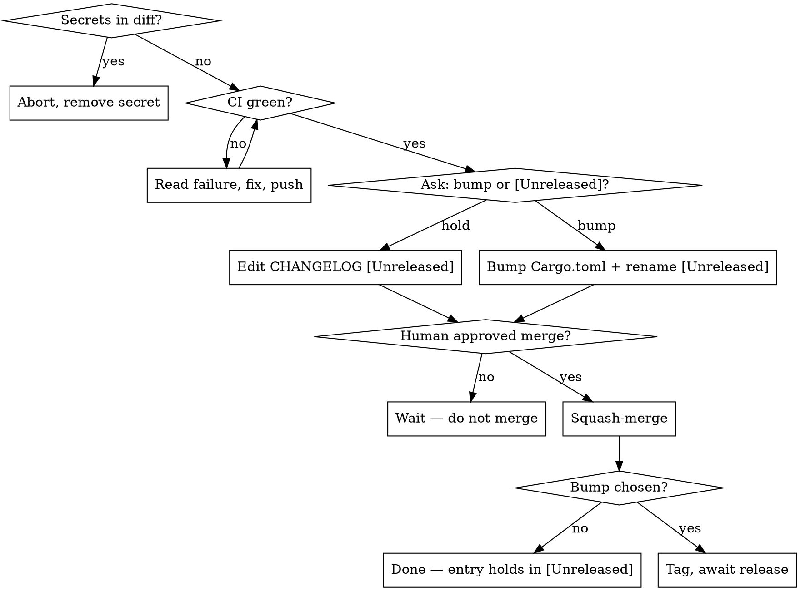

# Ship (ignis)

Land the current branch on `master` through a reviewed PR, then cut a tag that the
`Release` workflow turns into cross-platform binaries.

**Version source of truth: the `[package] version` in `ignis/Cargo.toml`.** The git
tag is `v<that version>`. There is no separate VERSION file.

## Iron rules

- **Never push a diff that contains a secret.** Scan first; abort on any hit.
- **Never squash-merge without explicit human approval.** Prepare everything, then stop and ask.
- **Before touching the CHANGELOG, ask the user**: add this change to `## [Unreleased]`, or bump to `vX.Y.Z` and cut a release? The answer decides what step 8 writes — but it all stays in **one** PR (no separate bump PR).
- **Never edit `Cargo.toml`/`Cargo.lock` versions or rename `## [Unreleased]` without that answer.** A bump that wasn't asked for is a process violation.
- Every gate must pass. On failure: stop, show the output, fix, re-run. No skipping.



## Process

### 0. Preflight
- Working tree clean (`git status`); commit or stash first.
- Not on `master` — if you are: `git switch -c <type>/<slug>`.
- Sync: `git fetch origin && git rebase origin/master` (resolve conflicts before continuing).

### 1. Gate — must all pass
```bash
cargo fmt --all -- --check        # if it fails: cargo fmt --all, then recommit
cargo clippy --workspace --all-targets -- -D warnings
cargo test --workspace            # unit + integration + pty TUI e2e
```
New behavior must have tests.

### 2. Smoke
```bash
cargo build --release
```

### 3. Dogfood (ask the human if it's needed)
**Ask the human whether this change needs dogfooding before shipping** — don't
decide silently. Dogfooding means using the built binary the way a real user
would, to catch what unit tests miss (TUI layout, real provider behavior, the
exact path you changed). Skip only with their OK (e.g. docs/CI-only changes).

**Cover every user-visible path of the feature, not just the change set.**
Unit tests prove the mechanism (decision logic, picker question shape); only
the real binary proves the *integrated path* (tool call → hook fires →
channel ferries to TUI → renderer reads state → reply travels back → mode
persists → next launch reads it). The classes of bug only dogfood catches:

- Wrong picker / view tags on shared infrastructure (a hardcoded label that
  was right for one caller and wrong for a later one)
- Stale CLI flags / state fields that look fine in unit tests but break the
  user-visible flow
- Wiring gaps between subsystems (footer doesn't read the new state, slash
  command doesn't persist, restart loses the setting)
- Visual: any color, alignment, or layout claim — tool output is plain text,
  you cannot judge colors from it, you must look at a PNG

Before opening the PR, list every user-visible path of the feature (the
slash command flow, the picker variants, the CLI flag, the state-restore on
restart, every observable behavior toggle). Drive each one against the real
binary. Skipping a path requires either (a) unit-test coverage that proves
the integration boundary the path would exercise is unreachable, or (b)
explicit human sign-off (e.g. `rm -rf /` family — the dogfood would put the
host at risk, accept unit-test coverage + sandbox follow-up).

Use the **`dogfood`** skill (`.claude/skills/dogfood/`) for how — it covers
both behavioral checks (one-shot CLI / state) and **visual** checks. For
anything visual (TUI), you can't judge colors or layout from tool output:
screenshot the real TUI to a PNG with `dogfood/tui_shot.py` and actually
`Read` it. Report exactly which paths you exercised and the result of each.

### 4. Secret scan — must be clean
```bash
git diff origin/master...HEAD | \
  grep -nE 'sk-[A-Za-z0-9-]{24,}|ghp_[A-Za-z0-9]{20,}|gho_[A-Za-z0-9]{20,}|AKIA[0-9A-Z]{16}|BSA[A-Za-z0-9]{20,}' \
  && echo 'SECRET FOUND — abort' || echo clean
```
Any hit → stop, remove it, re-scan. Never push a secret.

### 5. Open PR (+ screenshots if dogfood produced any)
```bash
git push -u origin HEAD
gh pr create --base master --title "<concise>" --body "<concise summary + checklist>"
```

**If step 3's dogfood produced PNG screenshots showing the feature working** — banners, pickers, footer segments, the resumed conversation view, before/after of a visual change — post them in a PR comment right after `gh pr create`. Reviewers shouldn't have to take "it looks correct" on faith.

Mechanism — commit the shots into the feature branch under `.github/screenshots/pr-<num>/` and reference them by raw URL. (`gh gist create` and `gh api` both refuse binary uploads, so the branch is the most reliable host.)

```bash
mkdir -p .github/screenshots/pr-<num>
cp /tmp/<shot1>.png /tmp/<shot2>.png .github/screenshots/pr-<num>/
git add .github/screenshots/pr-<num>/
git commit -m "docs(pr-<num>): dogfood screenshots"
git push

BRANCH=$(git rev-parse --abbrev-ref HEAD)
BASE="https://raw.githubusercontent.com/Fullstop000/ignis/${BRANCH}/.github/screenshots/pr-<num>"

gh pr comment <num> --body "$(cat <<EOF
## Screenshots from dogfood

| Path | Result |
|---|---|
| <step-1 label> |  |
| <step-2 label> |  |
EOF
)"
```

Pick the **production-ready** shots — the final ones that show the integrated feature, not intermediate debug captures from the dogfood iteration. One shot per user-visible path is enough; resist dumping every PNG (the squash-merge carries them into master forever). Skip this step entirely when the change is non-visual (CLI flag, internal refactor, doc-only PR).

### 6. Review (ask the human which reviewer)
Get a code review of the PR diff before chasing CI. **Ask the human which reviewer
to use — don't pick silently:**

- **Subagent** — dispatch one Claude review agent over the branch diff:
  `Agent(subagent_type: "general-purpose")` with: *"Review `git diff
  origin/master...HEAD` in this repo for bugs, regressions, and risky changes.
  Report only real issues as file:line + severity; skip style nits."*
- **Codex** — `codex exec review --base master`
- **Gemini** — `git diff origin/master...HEAD | gemini -p "Review this diff for
  bugs, regressions, and risky changes. List only real issues as file:line +
  severity; be concise."`

Then read the findings, **fix real issues and push**, and note any dismissed
finding with a one-line rationale. An *intended* breaking change is triaged
(documented in the CHANGELOG), not patched with compat code — see CLAUDE.md.
Proceed only when the diff is clean or every finding is triaged.

### 7. Make CI pass
```bash
gh pr checks --watch
```
If red: open the failing job, root-cause, fix, push, re-watch. Proceed only when every check is green.

### 8. Ask the user — bump or `[Unreleased]`? — then write the CHANGELOG
**Before editing anything in `CHANGELOG.md` or `Cargo.toml`, ask the user explicitly:**

> "This PR is ready to land. Add the entry to `[Unreleased]`, or bump to `vX.Y.Z` (suggested from commits since the last tag) and cut a release after merge?"

Compute the suggested version from commits since the last tag — `feat:` → minor, `fix:`/`chore:`/`docs:` → patch, `!`/`BREAKING CHANGE` → major. No prior tag → initial release; keep current version. Quote the suggested version in the question.

```bash
git log "$(git describe --tags --abbrev=0 2>/dev/null || echo)"..HEAD --pretty=%s
```

Whichever the user picks, all the edits land **in this same PR** — never split into a separate bump PR.

#### CHANGELOG entry rules (apply to both branches)

**Entries are one-line summaries only.** State *what changed* for a user, nothing more. No detail, no how-it-works, no implementation list, no rationale or trade-offs, no parentheticals enumerating internals. One short line per change.

**Every entry ends with a PR reference** `([#NNN](https://github.com/Fullstop000/ignis/pull/NNN))` so readers can jump to the diff and discussion. Group commits by the PR that landed them; one entry per PR is the norm.
- Good: `` - `/copy` — copy the last assistant reply to the system clipboard. ([#42](https://github.com/Fullstop000/ignis/pull/42)) ``
- Bad (no PR link): `` - `/copy` — copy the last assistant reply to the system clipboard. ``
- Bad (verbose): `` - `/copy` slash command — copies the last reply via a platform CLI tool (`pbcopy`/`clip`/`clip.exe`/…); 1 MiB cap, no native-clipboard dependency. ``

Section heading (`### Added` / `### Changed` / `### Fixed` / `### Security` / `### Breaking`) matches the change kind.

#### Branch A — user picked "hold under `[Unreleased]`"
Edit only `CHANGELOG.md`:
- Add the one-line entry under `## [Unreleased]`, in the right section heading.
- Do **not** touch `Cargo.toml`, `Cargo.lock`, or rename `[Unreleased]`.

```bash
git commit -am "docs(changelog): add #<N> under [Unreleased]"
git push
```

Skip step 10 entirely at merge time — no tag this round.

#### Branch B — user picked "bump to `vX.Y.Z`"
Edit all three in one commit:
1. `ignis/Cargo.toml`: `version = "X.Y.Z"`
2. `Cargo.lock`: refresh via `cargo build`
3. `CHANGELOG.md`: rename `## [Unreleased]` to `## [X.Y.Z] - YYYY-MM-DD` (carrying over any existing entries plus this PR's new line), then add a fresh empty `## [Unreleased]` above it.

```bash
cargo build                                # refresh Cargo.lock
git commit -am "chore(release): vX.Y.Z"
git push
```

Re-confirm CI green on the new commit.

### 9. Squash-merge (only after approval)
**STOP.** Tell the user the exact state:
- Branch A: "PR `<url>` is green, entry added under `[Unreleased]` — approve squash-merge?"
- Branch B: "PR `<url>` is green, bumped to `vX.Y.Z` — approve squash-merge?"

Wait for an explicit yes.
```bash
gh pr merge <num> --squash --delete-branch
git switch master && git pull --ff-only
```

### 10. Tag + await release (Branch B only)
If the user picked **hold** at step 8, stop here — the entry is on master under `[Unreleased]`, no tag this round.

If the user picked **bump**:
```bash
git tag vX.Y.Z && git push origin vX.Y.Z      # triggers the Release workflow
gh run watch "$(gh run list --workflow Release --limit 1 --json databaseId -q '.[0].databaseId')"
gh release view vX.Y.Z                         # confirm binaries are attached
```
Report the release URL.

## Common mistakes

| Mistake | Do instead |
|---------|-----------|
| Edit `Cargo.toml` or rename `[Unreleased]` without asking | Step 8 always starts with the bump-vs-hold question |
| Split the bump into a second PR | One PR carries the entry, the bump (if any), AND the feature work |
| Bump silently because "this commit looks like a feat:" | Conventional commits suggest the bump *version*, not the bump *decision* — the user owns the decision |
| Direct-push CHANGELOG or version edits to master | Everything rides on the feature PR |
| Auto-merge when CI turns green | Always wait for explicit approval |
| Dogfood made screenshots that never make it to the PR | After `gh pr create`, post the final dogfood shots as a PR comment so reviewers can see what landed |
| Tag ≠ `ignis/Cargo.toml` version | Tag is exactly `v<Cargo.toml version>` |
| Skip `cargo build` after editing `Cargo.toml` | Stale `Cargo.lock` fails the `--locked` release build |
| Secret-scan false alarm on placeholders | The regex targets real key shapes; `sk-your-…` placeholders are short and won't match |
