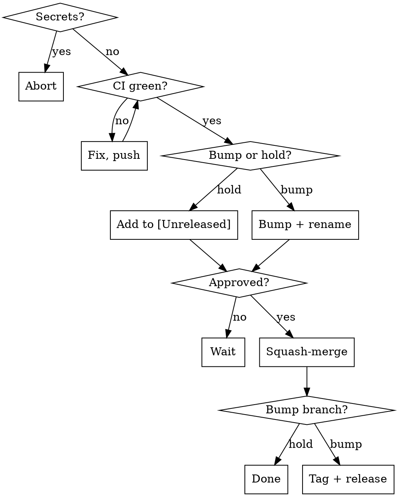

# Ship (ignis)

Land the branch on `master` via PR; if the user picks "bump", cut a tag that the Release workflow turns into binaries.

Version source of truth: `[package] version` in `ignis/Cargo.toml`. Tag is `v<that version>`. No VERSION file.

## Iron rules

- No secrets in any pushed diff. Scan first; abort on hit.
- No squash-merge without explicit human approval.
- Step 8 always starts with the bump-or-`[Unreleased]` question. **Never** edit `Cargo.toml`/`Cargo.lock` or rename `## [Unreleased]` without that answer.
- Everything lands in **one** PR — no separate bump PR.
- Every gate must pass. Failure → stop, fix, re-run. No skipping.



## Process

### 0. Preflight
- `git status` clean; commit or stash first.
- Not on `master` — if you are: `git switch -c <type>/<slug>`.
- `git fetch origin && git rebase origin/master` (resolve conflicts).

### 1. Gate — all must pass
```bash
cargo fmt --all -- --check        # fail → cargo fmt --all, recommit
cargo clippy --workspace --all-targets -- -D warnings
cargo test --workspace
```
New behavior needs tests.

### 2. Smoke
```bash
cargo build --release
```

### 3. Dogfood — ask the user
Ask if this change needs dogfooding (running the real binary as a user). Skip only with their OK. Cover every user-visible path (slash flow, CLI flag, restart-restore, every toggle), not just the change set. Visual changes require a PNG via `dogfood/tui_shot.py` — you can't judge colors from tool text. See `.claude/skills/dogfood/SKILL.md`.

### 4. Secret scan
```bash
git diff origin/master...HEAD | \
  grep -nE 'sk-[A-Za-z0-9-]{24,}|ghp_[A-Za-z0-9]{20,}|gho_[A-Za-z0-9]{20,}|AKIA[0-9A-Z]{16}|BSA[A-Za-z0-9]{20,}' \
  && echo SECRET || echo clean
```
Hit → stop, remove, re-scan.

### 5. Open PR (+ screenshots if dogfood produced any)
```bash
git push -u origin HEAD
gh pr create --base master --title "<concise>" --body "<concise summary + checklist>"
```

**If dogfood produced production-ready PNGs**, post them as PR comments — reviewers shouldn't take "looks right" on faith. **Do not commit screenshots to the repo.** Inline images live in the comment itself, not as repo paths.

Mechanism — drag-and-drop in the GitHub web UI uploads each image to `user-attachments.githubusercontent.com` and embeds the URL. There is no clean `gh` CLI for binary uploads (`gh gist create`, the issue-attachments API, and `gh api` all refuse PNGs).

Flow:

1. Open the PR page in your browser: `gh pr view <num> --web`
2. In the *Add a comment* box, drag-and-drop the relevant `/tmp/<shot>.png` files. GitHub uploads each, replaces the drop with ``, and renders inline on submit.
3. Format the comment as a table when there's more than one shot:

```markdown
## Screenshots from dogfood

| Path | Result |
|---|---|
| <label-1> | <paste-1> |
| <label-2> | <paste-2> |
```

Pick the **production-ready** shots — the final ones that show the integrated feature, not intermediate debug captures. One shot per user-visible path. Skip the whole step for non-visual changes (CLI flag, internal refactor, doc-only PR).

### 6. Review — ask the user which reviewer
- **Subagent** — `Agent(subagent_type: "general-purpose")` with: *"Review `git diff origin/master...HEAD` for bugs, regressions, risky changes. file:line + severity; skip style nits."*
- **Codex** — `codex exec review --base master`
- **Gemini** — `git diff origin/master...HEAD | gemini -p "Review for bugs/regressions/risk. file:line + severity; concise."`

Fix real findings; one-line rationale on dismissed ones. Intended breaking changes → CHANGELOG `### Breaking`, not compat shims.

### 7. CI
```bash
gh pr checks --watch
```
Red → root-cause, fix, push, re-watch.

### 8. Ask: bump or `[Unreleased]`?
Compute the suggested version from commits since last tag:
```bash
git log "$(git describe --tags --abbrev=0 2>/dev/null || echo)"..HEAD --pretty=%s
```
`feat:` → minor, `fix:`/`chore:`/`docs:` → patch, `!`/`BREAKING CHANGE` → major. No prior tag → keep current.

Ask the user, quoting the suggested version:
> "PR ready. Add to `[Unreleased]`, or bump to `vX.Y.Z` and cut a release after merge?"

#### CHANGELOG entry rules (both branches)
One-line user-facing summary. No internals, trade-offs, parentheticals.
Every entry ends with `([#NNN](https://github.com/Fullstop000/ignis/pull/NNN))`.
Section: `### Added` / `### Changed` / `### Fixed` / `### Security` / `### Breaking`.

- ✓ `` - `/copy` — copy the last assistant reply to the system clipboard. ([#42](…)) ``
- ✗ No PR link
- ✗ Verbose / internals

#### Branch A — hold
Edit only `CHANGELOG.md`. Add the line under `## [Unreleased]`. Don't touch `Cargo.toml`/`Cargo.lock`.
```bash
git commit -am "docs(changelog): add #<N> under [Unreleased]"
git push
```
Skip step 10.

#### Branch B — bump
One commit, three files:
1. `ignis/Cargo.toml` → `version = "X.Y.Z"`
2. `Cargo.lock` → `cargo build` to refresh
3. `CHANGELOG.md` → rename `## [Unreleased]` to `## [X.Y.Z] - YYYY-MM-DD`, add empty `## [Unreleased]` above
```bash
cargo build
git commit -am "chore(release): vX.Y.Z"
git push
```
Re-confirm CI green.

### 9. Squash-merge — only after approval
Tell the user the exact state:
- A: "PR `<url>` green, entry under `[Unreleased]` — approve squash-merge?"
- B: "PR `<url>` green, bumped to `vX.Y.Z` — approve squash-merge?"

Wait for explicit yes.
```bash
gh pr merge <num> --squash --delete-branch
git switch master && git pull --ff-only
```

### 10. Tag + release — Branch B only
```bash
git tag vX.Y.Z && git push origin vX.Y.Z
gh run watch "$(gh run list --workflow Release --limit 1 --json databaseId -q '.[0].databaseId')"
gh release view vX.Y.Z
```
Report the release URL.

## Common mistakes

| Mistake | Do instead |
|---|---|
| Edit `Cargo.toml` or rename `[Unreleased]` without asking | Step 8 starts with the question |
| Split the bump into a second PR | One PR for entry + bump (if any) + feature |
| Bump silently because the commit is `feat:` | Conventional commits suggest the *version*, not the *decision* |
| Direct-push CHANGELOG or version edits to master | Everything rides the feature PR |
| Auto-merge when CI turns green | Always wait for explicit approval |
| Dogfood shots stuck in `/tmp` | Post them as a PR comment via web-UI drag-and-drop |
| Committing PNGs to `.github/screenshots/` or anywhere in the repo | Repo stays binary-free; screenshots live in comments only |
| Tag ≠ `Cargo.toml` version | Tag is exactly `v<Cargo.toml version>` |
| Skip `cargo build` after editing `Cargo.toml` | Stale `Cargo.lock` fails the `--locked` release build |
| Secret-scan false alarm on placeholders | The regex targets real key shapes; `sk-your-…` is too short to match |
