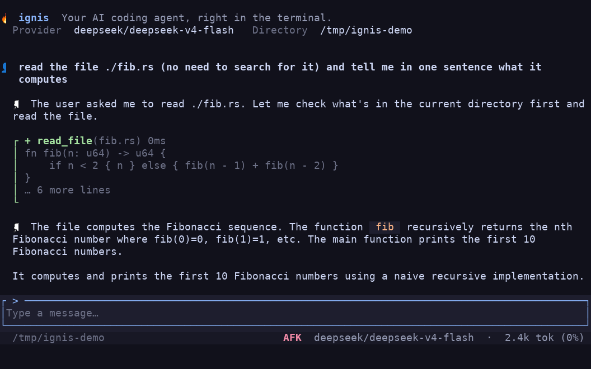

<div align="center">

# 🔥 Ignis

**Your AI coding agent, right in the terminal.**

Bring your own model — OpenAI, Anthropic, Gemini, DeepSeek, Kimi, or local
Ollama — and switch between them mid-session, all from one fast, self-contained
binary. No Node, no Python, no vendor lock-in.

[](https://github.com/Fullstop000/ignis/actions/workflows/ci.yml)
[](https://github.com/Fullstop000/ignis/releases)
[](https://codecov.io/gh/Fullstop000/ignis)
[](LICENSE)



</div>

---

## Install

```bash
curl -fsSL https://raw.githubusercontent.com/Fullstop000/ignis/master/install.sh | sh
```

Drops the binary in `~/.ignis/bin`. Already installed? Update in place with
`ignis upgrade`.

<details>
<summary>Other ways to install</summary>

```bash
# Pin a version or install dir
curl -fsSL …/install.sh | IGNIS_VERSION=v0.14.1 IGNIS_INSTALL_DIR=/usr/local/bin sh

# Self-update
ignis upgrade                     # download + replace the running binary
ignis upgrade --check             # report whether an update is available
ignis upgrade --version v0.14.1   # pin to a specific tag

# From source (stable Rust toolchain)
git clone https://github.com/Fullstop000/ignis.git
cd ignis && cargo build --release   # → target/release/ignis
```

Prebuilt binaries for Linux, macOS, and Windows are attached to every
[GitHub Release](https://github.com/Fullstop000/ignis/releases).

</details>

## Quickstart

```bash
# 1. Point ignis at a provider and key
mkdir -p ~/.ignis && cat > ~/.ignis/config.toml <<'TOML'
model = "deepseek/deepseek-v4-flash"

[providers.deepseek]
api_key = "sk-your-deepseek-key"
models  = ["deepseek-v4-flash"]
TOML

# 2. Launch the TUI…
ignis

# …or run one-shot from the shell
ignis "fix the failing test in src/parser.rs"
```

See [Configure](#configure) for more providers and per-model options.

## Features

- **TUI + CLI** — a native terminal TUI (`ratatui` + `crossterm`) and a one-shot
  CLI from the same binary.
- **Bring your own model** — OpenAI, DeepSeek, Kimi, Anthropic, Gemini, Ollama,
  and anything OpenAI-compatible. Switch model and reasoning effort at runtime
  with `/model`.
- **Streaming agent loop** — incremental text and reasoning, parallel or
  sequential tool execution, and lifecycle hooks.
- **Built-in tools** — read, write, and edit files; `grep`, `glob`, `list_dir`;
  `bash`; `web_fetch` and `web_search`; `ask_user`; and `agent` to delegate a
  subtask to a one-level sub-agent.
- **MCP servers** — connect external stdio [MCP](https://modelcontextprotocol.io)
  servers; their tools appear alongside the built-ins.
- **Skills** — load reusable `SKILL.md` instruction sets on demand, sharable
  across Claude Code, Codex, OpenCode, and Kimi.
- **Permission system** — every tool call passes a gate, with a built-in safety
  floor and user-declarable allow/ask/deny rules.
- **Sessions** — project-scoped history with `--resume`, auto-resume, and
  context compaction; export per-session stats with `ignis sessions export`.
- **Single binary** — no external runtime dependencies, with built-in
  self-update.

## Configure

Ignis reads `~/.ignis/config.toml`. The top-level `model` is the active
selection (`provider/model`); each provider lists the models it offers:

```toml
model = "deepseek/deepseek-v4-flash"

[providers.deepseek]
api_key = "sk-your-deepseek-key"
models  = [
  "deepseek-v4-flash",
  { name = "deepseek-v4-pro", reasoning = ["high", "max"], context = 128000 },
]
```

A model entry is either a bare name or an inline table with per-model metadata:
`reasoning` (effort levels the picker offers) and `context` (window size, else
looked up from [models.dev](https://models.dev)). `/model` switches the active
selection at runtime, saving it to `~/.ignis/state.json` — your `config.toml` is
never auto-edited. See [`config.example.toml`](config.example.toml) for every
provider and optional `web_search` / `compaction` settings.

> Your `~/.ignis/config.toml` holds secrets and is never committed. The
> repo-level `config.toml` is git-ignored on purpose — commit
> `config.example.toml` only.

## Usage

| Command | What it does |
| --- | --- |
| `ignis` | Interactive TUI (default) |
| `ignis "<prompt>"` | One-shot to stdout |
| `ignis --resume [id] [prompt]` | Resume the latest (or given) session |
| `ignis --afk` | Fully unattended: auto-approve tools, dismiss `ask_user` |
| `ignis mcp …` | Manage MCP servers (`add`, `list`, `get`, `remove`, `enable`, `disable`) |
| `ignis sessions export --html` | Export an HTML report of session stats |
| `ignis upgrade` | Update to the latest release |
| `ignis --help` | Full flag and subcommand list |

In the TUI: `Enter` sends, `↑/↓` walk history, `Ctrl+D` exits. Output renders
inline in the normal buffer, so scroll with your terminal/tmux as usual. Type
`/` for slash-command suggestions:

`/model` · `/afk` · `/resume` · `/clear` · `/compact` · `/copy` · `/skills` · `/mcp` · `/telemetry`

> `/copy` uses a built-in platform clipboard tool: `pbcopy` (macOS), `clip` /
> `clip.exe` (Windows/WSL). On a Linux desktop, install `wl-clipboard` or
> `xclip`.

## Permissions

Every tool call passes a permission gate before it runs. A built-in **safety
floor** (the `rm -rf /` family, edits to `.git/**`, `.ignis/**`, and shell init
files) always asks — and hard-denies under fully-unattended mode. On top of that
you can declare your own `allow` / `ask` / `deny` rules in config:

```toml
[permissions]
allow = ["bash(cargo *)", "edit_file(src/**)"]
ask   = ["bash(git push *)"]
deny  = ["read_file(.env)", "read_file(**/secrets/**)"]
```

Switch modes at runtime with `/afk`: *Hands-free* auto-approves tools but still
answers `ask_user`; *Fully unattended* auto-approves everything. The TUI footer
shows the active mode. Full grammar and precedence in
[`docs/permissions.md`](docs/permissions.md).

## Development

```bash
cargo test --workspace
cargo clippy --workspace --all-targets -- -D warnings
cargo fmt --all -- --check
```

See [CONTRIBUTING.md](CONTRIBUTING.md) for the workflow and
[CLAUDE.md](CLAUDE.md) for coding guidelines.

## License

Licensed under the [Apache License, Version 2.0](LICENSE).
